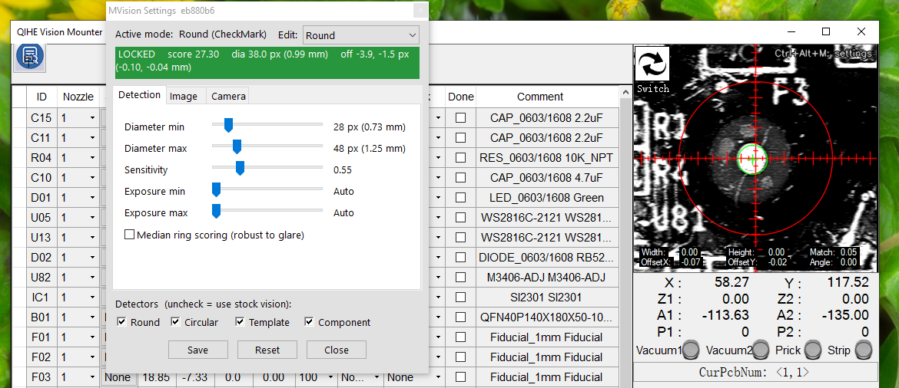

# tvm802-vision

A drop-in `MVision.dll` for the QiHe **TVM802A / TVM802B / TVM802BX** pick-and-place machines. It replaces the stock vision (which is jittery, drops lock, and runs slowly) with a sub-pixel-stable, motion-robust OpenCV pipeline. The bundle also includes a chip-level **DirectShow source filter** and a **Ctrl+Alt+M settings dialog** that drive the analog capture board's brightness, contrast, and gain directly in hardware.

> This project is not affiliated with QiHe. You supply your own original `MVision.dll` (which the installer renames to `MVision-orig.dll`); no vendor binaries are bundled.

## Install (5 minutes)

1. Download **`tvm802-vision-vX.Y.Z.zip`** from the [latest release](https://github.com/tinic/tvm802-vision/releases/latest).
2. Unzip it, close `SurfaceMount.exe`, then right-click **`install.bat` → Run as administrator**.
3. (Optional, and only if you want the chip-level Camera tab) Run **Zadig** once per machine. See **[install/INSTALL.md](install/INSTALL.md)** for the step-by-step walkthrough.

The full installation guide covers Zadig, the BX rename, troubleshooting, and uninstall: **[install/INSTALL.md](install/INSTALL.md)**.

**On the TVM802BX** (which uses a built-in Atom CPU): after running `install.bat`, rename `MVision-noavx2.dll` to `MVision.dll` in the SurfaceMount folder. The Atom N2800 does not support AVX2; `INSTALL.md` explains the details.

## What you get

- **All three down-vision mark modes** (Round, Circular, and ImageTemplate). Field-aware deinterlace and sub-pixel offsets keep detection stable even at high head speeds.
- **Up-vision component detection** (`CheckComp`). Rectilinear-symmetry detection with a minimum-area-rect fallback. It drives placement, signals missing parts back to the host, and exposes the per-stack `视觉阈值` (CompThre) as the operator's main tuning knob.
- **A live settings dialog** (`Ctrl + Alt + M`). Tune each mode at runtime, with a live LOCKED / NO LOCK readout. No recompile or restart needed.
- **A Camera tab** (available when the DirectShow filter is installed). Adjust the SAA7113 chip's hardware brightness, contrast, gain, AGC, sharpness, and prefilter directly. Settings are saved per mode in `MVision.ini`.

## Tuning

Press **`Ctrl + Alt + M`** while SurfaceMount is running to open the settings dialog. It has three tabs:

- **Detection** — per-mode fiducial knobs: radius bracket, accept sensitivity, exposure gate, and Round median-ring.
- **Image** — software adjustments applied before detection: gamma, brightness, contrast, black/white points, sharpen, and blur.
- **Camera** — chip-level hardware adjustments. This tab is only active when the DirectShow filter is installed (see Install step 3).

Below the tabs, a four-method *Detector* strip lets you disable our path for any single mode and fall back to the stock vision. Uncheck a box to disable it.

The host's per-stack **视觉阈值 (CompThre)** in ParamEdit is the main up-vision knob. It is a percentage (0–100%) of the ROI's maximum brightness, not an absolute gray level. A starting guide for common parts is in `CLAUDE.md` under *CompThre tuning table*.

## License

MIT — see [LICENSE](LICENSE).

---

For developer, architecture, build, and reverse-engineering notes, see **[CLAUDE.md](CLAUDE.md)**.
